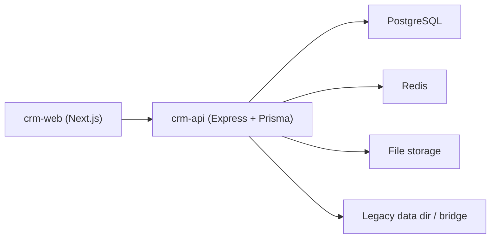

# Architecture

## Главное разделение

В репозитории есть два контура:

### Current CRM

- `apps/crm-api`
- `apps/crm-web`

Это основной текущий продукт, который нужно поддерживать и передавать новому разработчику.

### Legacy / Reference

- `apps/backend`
- `apps/dashboard`

Эти приложения не являются основной точкой развития. Они нужны как:

- reference старого поведения;
- источник части legacy-данных через bridge/import flow;
- исторический контекст для некоторых сценариев.

## Верхнеуровневая схема

## Как устроен current CRM

### Frontend

`apps/crm-web`

Основные зоны:
- `app/(app)` — маршруты текущего CRM
- `components` — большие рабочие панели и detail views
- `lib` — frontend data loaders, fetch helpers, server/browser API helpers

Основная композиция UI:
- route page -> live/detail panel -> loaders/actions -> `crm-api`

### Backend

`apps/crm-api`

Основные зоны:
- `src/server.ts` — bootstrap сервера
- `src/modules/router.ts` — корневой API router
- `src/modules/*/router.ts` — HTTP слой по доменам
- `src/modules/*/service.ts` — бизнес-логика
- `src/modules/deals/*` — shared logic сделок, особенно графики и lifecycle
- `prisma/schema.prisma` — текущая схема данных

## Главные домены

### Заказы и сделки

- заказы в current CRM — это верхний рабочий реестр
- дальше поток расходится в `rentals` и `buyouts`
- общая логика сделок сосредоточена в `src/modules/deals`

Ключевые backend-файлы:
- `apps/crm-api/src/modules/orders/router.ts`
- `apps/crm-api/src/modules/rentals/router.ts`
- `apps/crm-api/src/modules/buyouts/router.ts`
- `apps/crm-api/src/modules/deals/create-service.ts`
- `apps/crm-api/src/modules/deals/lifecycle-service.ts`
- `apps/crm-api/src/modules/deals/schedule-service.ts`

Ключевые frontend-файлы:
- `apps/crm-web/components/orders-live-panel.tsx`
- `apps/crm-web/components/rental-detail-panel.tsx`
- `apps/crm-web/components/buyout-detail-panel.tsx`
- `apps/crm-web/components/deal-payment-action.tsx`
- `apps/crm-web/components/deal-document-action.tsx`

### Клиенты

- профиль клиента;
- долговой snapshot;
- связь с арендой и выкупом;
- legacy enrichment по контрагенту.

Ключевые backend-файлы:
- `apps/crm-api/src/modules/clients/router.ts`
- `apps/crm-api/src/modules/clients/legacy-counterparty-sync.ts`

Ключевые frontend-файлы:
- `apps/crm-web/components/clients-live-panel.tsx`
- `apps/crm-web/components/client-detail-panel.tsx`
- `apps/crm-web/lib/clients-api.ts`

### Велосипеды и парк

- реестр единиц техники;
- detail page по конкретному велосипеду;
- связь с ремонтами и сделками.

Ключевые backend-файлы:
- `apps/crm-api/src/modules/fleet/router.ts`
- `apps/crm-api/src/modules/fleet/bike-unit-classifier.ts`
- `apps/crm-api/src/modules/repairs/router.ts`

Ключевые frontend-файлы:
- `apps/crm-web/components/fleet-live-panel.tsx`
- `apps/crm-web/components/bike-detail-panel.tsx`
- `apps/crm-web/components/repairs-live-panel.tsx`

### Банки

- реестр банков и платежных реквизитов;
- выбор банка на сделке;
- использование банка в платежах и возврате залога.

Ключевые backend-файлы:
- `apps/crm-api/src/modules/banks/router.ts`

Ключевые frontend-файлы:
- `apps/crm-web/components/banks-live-panel.tsx`
- `apps/crm-web/lib/banks-api.ts`

### Документы

- `/documents` — authoring: шаблоны, editor-first экран, коды, архив
- карточка сделки — issuing: выпуск, открыть, скачать, печать

Ключевые backend-файлы:
- `apps/crm-api/src/modules/documents/router.ts`
- `apps/crm-api/src/modules/documents/template-renderer.ts`

Ключевые frontend-файлы:
- `apps/crm-web/components/documents-live-panel.tsx`
- `apps/crm-web/components/documents-workspace-client.tsx`
- `apps/crm-web/components/documents-template-workbench.tsx`
- `apps/crm-web/components/deal-document-action.tsx`

### Финансы

- реестр финансовых транзакций;
- статьи;
- unified payment;
- reverse/reconcile/manual operations;
- связь с арендой, выкупом, штрафами, залогом и бизнес-расходами.

Ключевые backend-файлы:
- `apps/crm-api/src/modules/finance/router.ts`
- `apps/crm-api/src/modules/finance/service.ts`
- `apps/crm-api/src/modules/finance/articles.ts`

Ключевые frontend-файлы:
- `apps/crm-web/components/finance-live-panel.tsx`
- `apps/crm-web/components/finance-registry-actions.tsx`
- `apps/crm-web/components/finance-manual-transaction-panel.tsx`
- `apps/crm-web/lib/finance-api.ts`

### Импорт и legacy bridge

- новый CRM читает legacy operational JSON из старой CRM;
- bridge используется для обзора legacy-данных, dry-run и commit import;
- часть document/client hydration тоже опирается на legacy reference.

Ключевые backend-файлы:
- `apps/crm-api/src/modules/legacy/router.ts`
- `apps/crm-api/src/modules/legacy/legacy-source.ts`
- `apps/crm-api/src/modules/imports/router.ts`
- `apps/crm-api/src/modules/imports/service.ts`

Ключевые frontend-файлы:
- `apps/crm-web/components/legacy-import-dashboard.tsx`
- `apps/crm-web/lib/legacy-api.ts`

### Пользователи, роли, tenant

- tenant/runtime resolution;
- actor/session;
- permissions в UI и API.

Ключевые backend-файлы:
- `apps/crm-api/src/modules/auth/router.ts`
- `apps/crm-api/src/modules/tenants/runtime.ts`
- `apps/crm-api/src/modules/users/router.ts`
- `apps/crm-api/src/modules/users/permissions.ts`

Ключевые frontend-файлы:
- `apps/crm-web/lib/auth-api.ts`
- `apps/crm-web/components/auth-actor-context.tsx`
- `apps/crm-web/components/crm-shell.tsx`

## Где UI, где API, где business logic

### UI

UI — в `apps/crm-web/components`.  
Страницы в `apps/crm-web/app/(app)` обычно очень тонкие и просто подключают нужную panel/detail view.

### API

HTTP-слой — в `apps/crm-api/src/modules/*/router.ts`.  
Если нужно понять, какой endpoint вызывает конкретный экран, обычно начинайте отсюда и из `apps/crm-web/lib/*.ts`.

### Business logic

Основная бизнес-логика сосредоточена в:
- `apps/crm-api/src/modules/deals/*`
- `apps/crm-api/src/modules/finance/service.ts`
- `apps/crm-api/src/modules/documents/*`
- `apps/crm-api/src/modules/imports/service.ts`

Если изменение затрагивает платежи, графики, штрафы, залог, документы или импорт, почти всегда критичный код находится именно в этих сервисах, а не в page-level UI.

## Архитектурные границы, которые важно понимать

- `crm-web` не реализует бизнес-правила сам, а в основном оркестрирует рабочие экраны и вызывает `crm-api`
- все критичные расчеты по графикам, долгам, штрафам и finance effects живут на backend
- `/documents` отвечает за шаблоны и authoring, а выпуск документа из сделки — это отдельный issue flow в карточке сделки
- legacy bridge нужен для безопасного перехода со старой системы, но его лучше считать временным слоем совместимости, а не целевой архитектурой

## Что читать дальше

- `README.md` — быстрый вход
- `docs/BUSINESS_LOGIC.md` — бизнес-смысл доменов
- `docs/MODULE_MAP.md` — куда идти по коду
- `docs/API_MAP.md` — какие роуты критичны
- `docs/KNOWN_ISSUES.md` — что рискованно трогать без понимания
